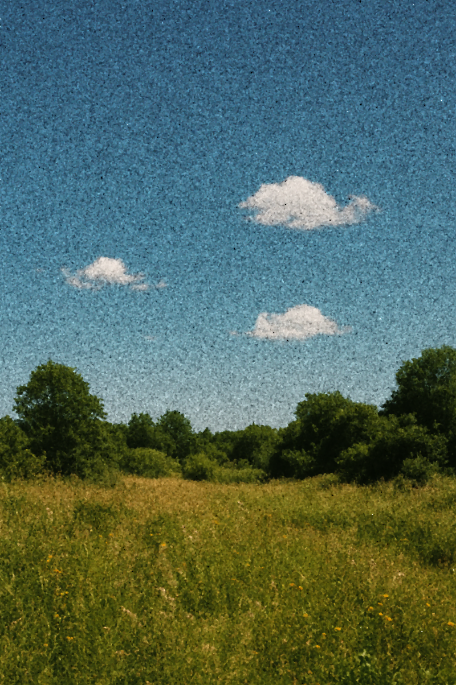

# 🧼 Filtro da Mediana com Python e NumPy

Este repositório apresenta a aplicação do filtro da mediana em uma imagem com ruído.

## 🖼️ Exemplo Visual

Imagem original com ruído:


Imagem após aplicação do filtro da mediana:



## 🧠 Como funciona

O filtro da mediana é amplamente utilizado para remoção de ruídos do tipo "sal e pimenta" em imagens. Em vez de substituir cada pixel por uma média dos vizinhos, ele substitui pelo valor **mediano**, o que preserva melhor as bordas e remove eficientemente os ruídos.

O script `mediana.py` aplica esse filtro usando `sliding_window_view`, que permite uma janela deslizante sobre a imagem para cálculo eficiente da mediana em cada região.

### Função principal:

```python
def filtro_mediana_numpy(imagem_pil, tamanho_janela=5):
    imagem_np = np.array(imagem_pil)
    imagem_expandida = np.pad(imagem_np, ((offset, offset), (offset, offset), (0, 0)), mode='edge')
    janelas = sliding_window_view(imagem_expandida, (tamanho_janela, tamanho_janela, 3))
    janelas = janelas.reshape((altura, largura, tamanho_janela * tamanho_janela, 3))
    imagem_filtrada = np.median(janelas, axis=2).astype(np.uint8)
