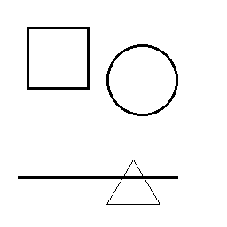
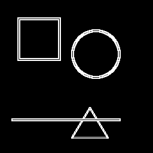

# 🧠 Filtro de Detecção de Bordas com Sobel (Python + NumPy)

Este repositório contém um exemplo prático de aplicação do filtro de Sobel, utilizado para detecção de bordas em imagens. O algoritmo é implementado manualmente em Python usando NumPy e a biblioteca Pillow para manipulação de imagens.

## 🖼️ Exemplo Visual

Imagem original:



Imagem com bordas destacadas pelo filtro de Sobel:



## 🧠 Como funciona

O filtro de Sobel é uma técnica clássica de detecção de bordas que calcula a variação de intensidade de pixels nas direções horizontal e vertical. Isso permite destacar regiões da imagem onde há mudanças bruscas de cor ou intensidade, que geralmente correspondem às bordas dos objetos.

No script `sobel.py`, a imagem é:

1. Convertida para tons de cinza (escala de cinza).
2. Transformada em matriz NumPy.
3. Processada pixel a pixel com convoluções dos seguintes kernels:

```python
sobel_x = np.array([[-1, 0, 1],
                    [-2, 0, 2],
                    [-1, 0, 1]])

sobel_y = np.array([[-1, -2, -1],
                    [ 0,  0,  0],
                    [ 1,  2,  1]])
