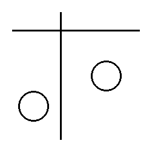
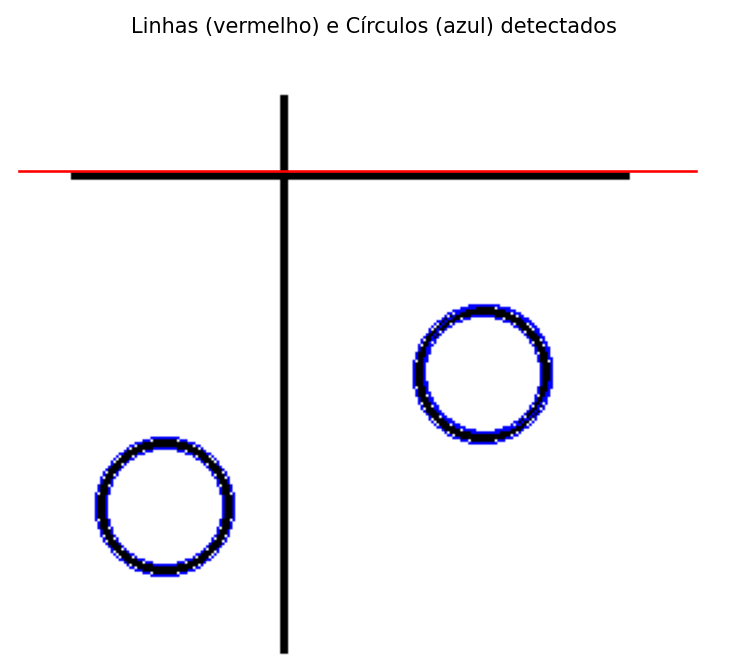

# 🔍 Detecção de Linhas e Círculos com Transformada de Hough

Este repositório demonstra como detectar **linhas retas** e **círculos** em uma imagem utilizando a **Transformada de Hough**.
## 🖼️ Exemplo Visual

Imagem original:



Imagem com linhas (vermelho) e círculos (azul) detectados:



## 🧠 Como funciona

O script `hough.py` realiza os seguintes passos:

1. Carrega a imagem `4.png` e converte para tons de cinza.
2. Aplica o detector de bordas de Canny (`skimage.feature.canny`).
3. Executa a Transformada de Hough para detecção de:
   - **Linhas retas**, com `transform.hough_line` e `hough_line_peaks`.
   - **Círculos**, com `hough_circle` e `hough_circle_peaks`.
4. Desenha os resultados:
   - Linhas em **vermelho** com `matplotlib`.
   - Círculos em **azul**, traçando as bordas detectadas diretamente na imagem com `circle_perimeter`.

### Trechos principais do código:

```python
# Detecção de linhas
h, theta, d = transform.hough_line(bordas)
picos_linhas = transform.hough_line_peaks(h, theta, d)

# Detecção de círculos
radii = np.arange(15, 40, 1)
hough_res = hough_circle(bordas, radii)
acumulador, cx, cy, raios_detectados = hough_circle_peaks(hough_res, radii, total_num_peaks=5)
