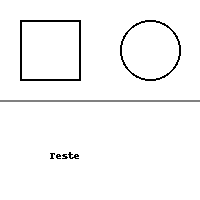

# 🔍 Redimensionamento de Imagens com Interpolação Bicúbica

Este repositório apresenta um exemplo simples e eficaz de como redimensionar uma imagem utilizando interpolação bicúbica.

## 🖼️ Exemplo Visual

Imagem original:



Imagem redimensionada com interpolação bicúbica:


## 🧠 Como funciona

O script `interp.py` realiza as seguintes etapas:

1. Carrega a imagem original com o Pillow.
2. Calcula o novo tamanho desejado (neste exemplo, o dobro da largura e altura originais).
3. Redimensiona a imagem utilizando o método de interpolação bicúbica (`Image.BICUBIC`).
4. Salva a nova imagem com o nome `5mod.png`.

### Trecho principal do código:

```python
imagem_redimensionada = imagem.resize((nova_largura, nova_altura), Image.BICUBIC)
