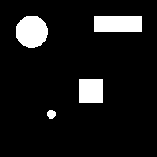

# 🧱 Erosão Morfológica em Imagens Binárias com Python

Este repositório apresenta um exemplo de aplicação de **erosão morfológica** em uma imagem binária.

## 🖼️ Exemplo Visual

Imagem binária original:



Imagem após erosão:


## 🧠 Como funciona

A **erosão** é uma operação morfológica utilizada para "encolher" objetos brancos em imagens binárias. Ela é útil para:

- Remover ruídos pequenos
- Separar objetos conectados
- Reduzir detalhes finos

No script `erosao.py`, a imagem passa pelos seguintes passos:

1. É convertida em tons de cinza (`convert('L')`).
2. É binarizada com um limiar de 128.
3. A erosão é aplicada com uma estrutura de vizinhança 3x3:

```python
estrutura = np.ones((3, 3), dtype=np.uint8)
imagem_erodida = binary_erosion(binaria, structure=estrutura).astype(np.uint8)
